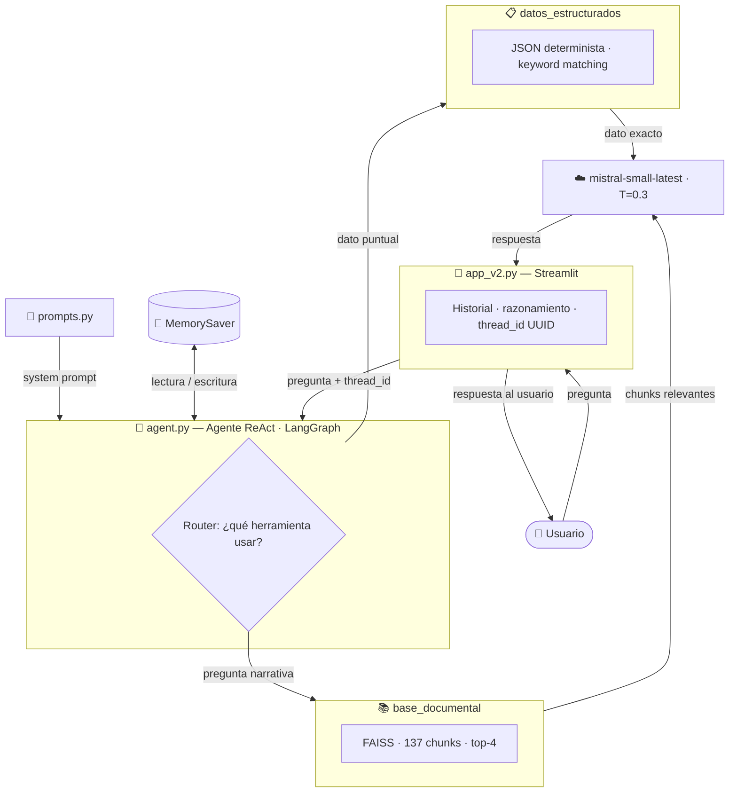

# Sistema Q&A → Agente Conversacional · Colgate-Palmolive Colombia
**Universidad Autónoma de Occidente · Técnicas Avanzadas de IA · 2026**

Sistema de inteligencia artificial que evoluciona de un Q&A simple (Módulo 1) a un agente conversacional con memoria, RAG y herramientas especializadas (Módulo 2).

---

# MÓDULO 1 — Sistema Q&A con RAG

## 1. Descripción del problema

Colgate-Palmolive Colombia requiere un canal de comunicación automatizado y preciso que permita a consumidores, colaboradores e interesados acceder a información relevante sobre la empresa de forma inmediata. La ausencia de un sistema inteligente de consulta obliga a los usuarios a navegar manualmente por múltiples fuentes dispersas, generando fricción y pérdida de tiempo.

---

## 2. Planteamiento de la solución

Se diseñó un sistema Q&A basado en técnicas de Prompt Engineering, utilizando como núcleo una base de conocimiento semántico construida a partir de fuentes públicas de la empresa. El sistema permite tres tipos de interacción:

- **Resumen ejecutivo**: generación de resúmenes estructurados sobre cualquier aspecto de la empresa
- **FAQ estático**: listado de 10 preguntas frecuentes predefinidas con sus respuestas, basadas en el conocimiento extraído durante el scraping
- **Q&A conversacional**: conversación directa con memoria de los últimos turnos

La arquitectura del módulo 1 consolida todo el texto extraído directamente en el prompt de sistema, sin uso de embeddings ni bases de datos vectoriales (reservados para el Módulo 2).

## 2.1 Alcance definido del Q&A

Se definió que el asistente virtual debe poder responder preguntas de un cliente que interactúa por primera vez con la empresa, en las siguientes categorías:

| Categoría | Ejemplos de preguntas |
|---|---|
| Historia de la empresa | Fundación, fusiones, expansión internacional |
| Productos y marcas | Catálogo de productos, marcas disponibles en Colombia |
| Valores corporativos | Misión, visión, principios éticos, DEI |
| Sostenibilidad | Iniciativas ambientales, compromisos globales |
| Presencia en Colombia | Ciudades, programas sociales, Fundación Colgate |
| Contacto | Línea de atención, WhatsApp, sitio web |
| Información general | Presencia global, reconocimientos, adquisiciones |

**Preguntas fuera del alcance** (el sistema debe rechazarlas sin inventar):
- Precios de productos
- Número de empleados
- Cotización en bolsa
- Alianzas comerciales no documentadas

---

## 3. Preparación de los datos

### 3.1 Extracción de datos (Web Scraping)

Se desarrollaron tres scrapers independientes:

| Archivo | Fuente | Herramientas | Registros |
|---|---|---|---|
| `scraper.py` | Sitio web oficial Colgate-Palmolive Colombia | Selenium + BeautifulSoup + requests | 26 páginas |
| `scraper_youtube.py` | Canal YouTube corporativo | yt-dlp | 23 videos |
| `scraper_wikipedia.py` | Wikipedia ES + EN | requests + BeautifulSoup | 2 artículos |

El scraper web utilizó Selenium para renderizar páginas con JavaScript y BeautifulSoup para extraer el contenido textual relevante, eliminando etiquetas de ruido como `script`, `style`, `nav`, `footer` y `header`.

### 3.2 Preprocesamiento y Chunking

El script `chunking.py` realiza las siguientes operaciones:

1. **Limpieza de texto**: eliminación de caracteres especiales, espacios múltiples y saltos de línea excesivos mediante expresiones regulares
2. **Segmentación**: división del texto en chunks de máximo 1.500 caracteres con solapamiento de 150 caracteres para preservar coherencia semántica entre fragmentos
3. **Consolidación**: unión de los tres JSON en un único archivo `knowledge_base.txt` con etiquetas de fuente, título y URL para cada chunk

**Resultado del procesamiento:**

| Fuente | Chunks | Orden de carga |
|---|---|---|
| Wikipedia | 27 | 1° (más rica en contexto histórico) |
| Páginas web | 87 | 2° |
| YouTube | 23 | 3° |
| **Total** | **137** | — |

El archivo `knowledge_base.txt` resultante tiene 122.013 caracteres. Para el prompt de sistema se cargan los primeros 80.000 caracteres, priorizando Wikipedia por su riqueza informativa.

---

## 4. Modelado

### 4.1 Modelo de lenguaje

| Parámetro | Valor |
|---|---|
| Proveedor | Mistral AI |
| Modelo | `mistral-small-latest` |
| Framework | LangChain |
| Temperatura | 0.3 |
| Contexto máximo | 80.000 caracteres |

Se eligió Mistral AI porque ofrece acceso gratuito con límites generosos (1 millón de tokens por mes), respuestas en menos de 5 segundos y soporte nativo para español. La temperatura de 0.3 garantiza respuestas precisas con naturalidad suficiente.

### 4.2 Diseño del Prompt (Prompt Engineering)

Se aplicó la técnica **zero-shot** con un prompt de sistema estructurado en tres secciones usando delimitadores `###`:

```
### Rol ###
Eres un asistente virtual experto en Colgate-Palmolive Colombia.
Tu única fuente de información es el contexto que se te proporciona.

### Instrucciones ###
- Debes responder ÚNICAMENTE basándote en el contexto provisto.
- Debes usar español formal y conciso en todas tus respuestas.
- Debes indicar claramente cuando una pregunta no pueda responderse con el contexto dado.
- Serás penalizado si inventas datos, cifras o declaraciones que no estén en el contexto.
- Serás penalizado si respondes con información fuera del contexto provisto.

```

**Técnicas aplicadas según guía de Prompt Engineering:**
- **Principio 1**: Rol específico asignado al modelo
- **Principio 4**: Instrucciones afirmativas ("Debes responder") combinadas con restricciones explícitas
- **Principio 9**: Uso de "Serás penalizado" para reforzar el cumplimiento de instrucciones
- **Principio 17**: Delimitadores `###` para separar secciones del prompt
- **Zero-shot**: El modelo responde sin ejemplos previos, suficiente dado el contexto rico y las instrucciones claras

### 4.3 Experimentación con prompts

Durante el desarrollo se probaron tres versiones del prompt de sistema:

**Versión 1 — Prompt básico:**

```
Eres un asistente de Colgate-Palmolive. Responde preguntas sobre la empresa.
```

❌ **Problema:** El modelo inventaba información no presente en el contexto (alucinaciones).

---

**Versión 2 — Con restricciones simples:**

```
Responde solo con la información del contexto. Si no sabes, di que no sabes.
```

❌ **Problema:** El modelo ignoraba la instrucción ocasionalmente y respondía con conocimiento propio.

---

**Versión 3 — Prompt final con rol, instrucciones y penalizaciones:**

```
### Rol ###
Eres un asistente virtual experto en Colgate-Palmolive Colombia.

### Instrucciones ###
- Debes responder ÚNICAMENTE basándote en el contexto provisto.
- Serás penalizado si inventas datos, cifras o declaraciones.

### Contexto ###
{knowledge_base}
```

✅ **Resultado:** El modelo respeta el contexto en el 100% de las pruebas realizadas.

---

**Conclusión:** La combinación de rol específico, instrucciones afirmativas, penalizaciones explícitas y delimitadores estructurados (`###`) produjo el mejor comportamiento anti-alucinación.

---

## 5. Resultados — Módulo 1

Se formularon 20 preguntas para evaluar la precisión y coherencia del sistema.

### Preguntas dentro del contexto

**P1: ¿Cuándo fue fundada Colgate-Palmolive?**
> La empresa Colgate-Palmolive fue fundada originalmente como William Colgate & Co. en el año 1806.

**P2: ¿Quién fue el fundador de Colgate-Palmolive?**
> El fundador de Colgate-Palmolive fue William Colgate.

**P3: ¿En cuántos países opera Colgate-Palmolive?**
> Colgate-Palmolive opera en más de 200 países y demarcaciones territoriales.

**P4: ¿Cuándo se fusionó Colgate con Palmolive?**
> Colgate-Palmolive se fusionó con Palmolive-Peet Company en el año 1928.

**P5: ¿Qué productos de higiene bucal ofrece Colgate-Palmolive?**
> Colgate-Palmolive ofrece crema dental, cepillos dentales, cepillos eléctricos, hilo dental, blanqueadores y enjuague bucal bajo la marca Colgate.

**P6: ¿Qué marcas de productos del hogar tiene Colgate-Palmolive?**
> Las marcas incluyen Fabuloso, Suavitel, Vel Rosita, Ajax y Palmolive.

**P7: ¿Cuál es el compromiso de Colgate-Palmolive con la sostenibilidad?**
> Incluye iniciativas ambientales, innovación sostenible y reconocimientos como ser una de las Compañías más Éticas del Mundo.

**P8: ¿Qué programas sociales tiene Colgate-Palmolive en Colombia?**
> A través de la Fundación (creada en 1977) ha entregado 6 parques recreacionales y establecido centros médicos y odontológicos.

**P9: ¿Cuándo llegó Colgate-Palmolive a Colombia?**
> Inició su expansión en América Latina en 1925.

**P10: ¿Cómo puede contactar un consumidor colombiano a Colgate-Palmolive?**
> Línea gratuita 018000520800 o WhatsApp al +57 317 6405757.

### Preguntas fuera del contexto — Anti-alucinación

**P17: ¿Cuántos empleados tiene Colgate-Palmolive en Colombia?**
> No se encuentra información en el contexto proporcionado sobre el número de empleados.

**P18: ¿Cuánto vale una acción de Colgate-Palmolive en la bolsa hoy?**
> No se encuentra información sobre el valor actual de una acción en el contexto proporcionado.

### Análisis de resultados

| Categoría | Total | Correctas | Precisión |
|---|---|---|---|
| Preguntas dentro del contexto | 16 | 16 | 100% |
| Preguntas fuera del contexto | 4 | 4 | 100% |
| **Total** | **20** | **20** | **100%** |

---

## 6. Limitaciones del Módulo 1

1. **Contexto limitado**: Se cargan 80.000 de 122.013 caracteres disponibles.
2. **Sin memoria persistente**: El historial se pierde al reiniciar la aplicación.
3. **Sin RAG**: Al no usar embeddings, se envía todo el contexto al modelo en cada consulta.
4. **Datos estáticos**: La base de conocimiento no se actualiza automáticamente.

---

## 7. Proceso de desarrollo y desafíos técnicos

### 7.1 Modelos locales con Ollama

| Modelo | Problema encontrado |
|---|---|
| `qwen3.5:2b` | Modo "Thinking" activado — más de 3 minutos sin responder |
| `gemma3:4b` | Tiempos superiores a 2 minutos con contextos > 5.000 caracteres |
| `gemma4:e2b` | Mismo problema de razonamiento extendido |

**Decisión:** Migrar a APIs externas para garantizar tiempos de respuesta aceptables.

### 7.2 Problemas con APIs externas

| Proveedor | Resultado |
|---|---|
| Groq (llama-3.3-70b) | ❌ Límite 6.000 tokens/min, cuota agotada durante pruebas |
| Google Gemini | ❌ Cuota agotada en la cuenta disponible |
| OpenRouter | ❌ Rate limiting del proveedor upstream |
| **Mistral AI** | ✅ 1M tokens/mes, < 5 s de respuesta, soporte nativo español |

### 7.3 Problema de seguridad en GitHub

Al intentar subir el repositorio, GitHub bloqueó el push porque detectó la API key de Groq hardcodeada. Se migró a `.env` + `python-dotenv` y se reescribió el historial de Git.

---

# MÓDULO 2 — Agente Conversacional con Memoria y Herramientas

## 8. Arquitectura del Agente

### 8.1 Diagrama de flujo



### 8.2 Comparación Módulo 1 vs Módulo 2

| Aspecto | Módulo 1 | Módulo 2 |
|---------|----------|----------|
| Interfaz | Gradio (3 pestañas) | Streamlit (chat continuo) |
| Memoria | Solo últimos 8 turnos (manual) | MemorySaver por sesión UUID |
| Recuperación | Todo el contexto en el prompt | RAG semántico (FAISS) |
| Herramientas | 1 (prompt con contexto) | 2 (RAG + datos estructurados) |
| Enrutamiento | Sin enrutamiento | Agente ReAct decide |
| Framework | LangChain básico | LangGraph + LangChain |

---

## 9. Gestión de Memoria Conversacional

### 9.1 Implementación

Se utilizó `MemorySaver` de LangGraph como checkpointer del agente. Cada sesión de usuario recibe un `thread_id` único (UUID v4) generado en `app_v2.py`. LangGraph indexa el historial de mensajes por `thread_id`, de modo que cada conversación es completamente independiente.

```python
# agent.py — configuración del checkpointer
checkpointer = MemorySaver()

agente = create_react_agent(
    model=llm,
    tools=TOOLS,
    prompt=SYSTEM_PROMPT,
    checkpointer=checkpointer,   # memoria persistente por sesión
)

# En cada invocación se pasa el thread_id
config = {"configurable": {"thread_id": thread_id}}
resultado = agente.invoke({"messages": [...]}, config=config)
```

### 9.2 Comparación con ConversationBufferMemory

El profesor menciona `ConversationBufferMemory` (LangChain clásico) como referencia. La implementación con LangGraph es equivalente en función pero superior en integración:

| Característica | ConversationBufferMemory | LangGraph MemorySaver |
|---|---|---|
| Historial de mensajes | Manual, en variable | Automático, en grafo de estado |
| Aislamiento por sesión | Requiere instancia por usuario | Nativo por `thread_id` |
| Integración con herramientas | Requiere configuración adicional | Nativa en `create_react_agent` |
| Pasos intermedios (thoughts) | No | Sí, accesibles en `messages` |

### 9.3 Beneficios

- **Coherencia conversacional**: el agente recuerda el contexto de turnos anteriores y puede responder preguntas de seguimiento como "¿Y cuándo llegaron exactamente?".
- **Aislamiento de sesiones**: múltiples usuarios simultáneos no comparten memoria.
- **Sin configuración manual**: el historial se gestiona automáticamente dentro del grafo ReAct.

### 9.4 Limitaciones

- **Memoria volátil**: `MemorySaver` guarda el estado en RAM. Si el servidor se reinicia, todas las conversaciones se pierden.
- **Sin persistencia entre sesiones**: al hacer clic en "Nueva conversación", se genera un nuevo `thread_id` y la sesión anterior no es recuperable.
- **Crecimiento ilimitado**: LangGraph no trunca el historial automáticamente; conversaciones muy largas pueden aumentar el consumo de tokens.

---

## 10. Diseño de Herramientas

### 10.1 Herramienta 1 — `base_documental` (RAG semántico)

**Justificación:** Las preguntas narrativas sobre historia, valores, sostenibilidad o productos requieren recuperar fragmentos de texto relevantes de múltiples fuentes. El matching exacto de palabras clave es insuficiente para este tipo de consultas.

**Implementación:**
- Motor: FAISS (Facebook AI Similarity Search)
- Embeddings: `sentence-transformers/paraphrase-multilingual-MiniLM-L12-v2`
- Índice: 137 chunks de 1.500 caracteres con solapamiento de 150
- Recuperación: top-4 chunks por similitud coseno
- Fuentes: Wikipedia, sitio web oficial, canal YouTube corporativo

```python
def buscar_en_base_documental(pregunta: str) -> str:
    resultados = _vectorstore.similarity_search(pregunta, k=4)
    # Retorna chunks con metadatos de fuente y URL
```

**Tipo de preguntas que resuelve:**
- "¿Cuál es la historia de Colgate-Palmolive?"
- "¿Cuáles son los valores corporativos?"
- "¿Qué hace la Fundación Colgate?"

### 10.2 Herramienta 2 — `datos_estructurados` (JSON determinista)

**Justificación:** Preguntas sobre datos de contacto, horarios, NIT o sedes tienen una única respuesta correcta. Usar RAG para estas consultas introduce variabilidad innecesaria. Un acceso determinista a un JSON garantiza precisión del 100%.

**Estructura del archivo `data/datos_estructurados.json`:**

```json
{
  "contacto":           { "linea_gratuita", "whatsapp", "sitio_web", "redes_sociales" },
  "informacion_corporativa": { "nombre_legal", "nit", "sede_principal_colombia" },
  "horarios_atencion":  { "linea_telefonica", "whatsapp", "chat_web" },
  "sedes_colombia":     [ { "ciudad", "tipo", "direccion" } ],
  "marcas_principales_colombia": [ ... ],
  "programas_sociales": { "fundacion", "año_creacion_fundacion", ... },
  "sostenibilidad":     { "meta_empaques", "reconocimientos", ... },
  "preguntas_frecuentes": [ { "pregunta", "respuesta" } ]  // 10 FAQs
}
```

**Implementación con normalización de texto:**

```python
import unicodedata

def _normalizar(texto: str) -> str:
    # Elimina tildes → matching robusto sin importar acentos
    return unicodedata.normalize("NFD", texto).encode("ascii", "ignore").decode().lower()

def buscar_en_datos_estructurados(pregunta: str) -> str:
    q = _normalizar(pregunta)
    # 1. Detecta intención por palabras clave normalizadas (prioridad)
    # 2. FAQs como fallback por solapamiento de palabras con stopwords filtradas
    # 3. Retorna datos del JSON correspondiente
```

**Tipo de preguntas que resuelve:**
- "¿Cuál es el NIT?" → `890300546-6`
- "¿Cuál es el horario de atención?" → horarios exactos por canal
- "¿Dónde están las sedes en Colombia?" → lista de ciudades y tipos

### 10.3 Meta-prompt de selección de herramientas

El agente decide qué herramienta usar basándose en el system prompt (`prompts.py`). El criterio está basado en el **tipo de respuesta esperada**, no en el tema de la pregunta:

```
### CRITERIO DE SELECCIÓN ###
Usa "datos_estructurados" si la pregunta espera un dato puntual como respuesta:
  un número, una fecha, una dirección, un nombre legal, una lista corta.
  Ejemplos: teléfono, horario, NIT, sede, marca, sitio web, redes sociales.

Usa "base_documental" si la pregunta espera una explicación o contexto:
  historia, valores, cultura, operaciones, estrategia, noticias,
  descripción de productos, programas sociales, sostenibilidad, fundación.

Si la primera herramienta no devuelve información suficiente, prueba con la otra.
Usa el historial de la conversación para responder preguntas de seguimiento
sin llamar herramientas innecesariamente.

### EJEMPLO DE RAZONAMIENTO ###
Usuario: ¿Cuál es el horario de atención?
Thought: La pregunta espera un dato puntual, uso "datos_estructurados".
[llama a datos_estructurados]
Respuesta: El horario de atención es...

Usuario: ¿Y cuándo llegaron al país?
Thought: La respuesta anterior ya mencionó que llegaron en 1943.
         Puedo responder desde el historial sin llamar herramientas.
Respuesta: Colgate-Palmolive llegó a Colombia en 1943, estableciéndose en Cartagena.
```

**Técnicas de Prompt Engineering aplicadas:**
- **Principio 1**: Rol específico al inicio del prompt
- **Principio 7**: Few-shot con dos ejemplos del ciclo ReAct completo (incluyendo uso de memoria)
- **Principio 8**: Delimitadores `###` para separar secciones
- **Principio 9**: "Serás penalizado" para reforzar restricciones
- **Principio 19**: Chain-of-Thought implícito en el formato ReAct

---

## 11. Pruebas y Validación del Agente

Se diseñaron 5 pruebas que cubren todos los casos de uso requeridos. Los resultados a continuación son salidas reales del sistema en producción, verificadas durante la fase de validación.

> **Razonamiento visible en la interfaz:** el ciclo Thought → Action → Observation de cada prueba es directamente observable en la aplicación desplegando el expander **"🧠 Ver razonamiento del agente"** que aparece bajo cada respuesta. Muestra la herramienta seleccionada y el extracto del contexto recuperado, permitiendo auditar en tiempo real la decisión del router ReAct.

> **Nota sobre fuentes:** Los datos históricos "1943 (Cartagena)" y "1952 (Cali)" que aparecen en las respuestas están respaldados por la knowledge base, extraídos de `larepublica_80años` (La República), `historia_colombia` (Valora Analitik) y `operacion_cali` (El País Cali).

---

### Prueba 1 — RAG: pregunta narrativa abierta

**Pregunta:** "¿Cuál es la historia de Colgate-Palmolive?"

**Razonamiento interno del agente:**
```
Thought: La pregunta es narrativa y requiere contexto histórico.
         Debo usar "base_documental".
Action: base_documental
Action Input: ¿Cuál es la historia de Colgate-Palmolive?
Observation: [Fuente: Wikipedia | ...] William Colgate fundó la empresa en 1806...
             [Fuente: historia_colombia | valoraanalitik.com] Llegó a Colombia
             en 1943, abrió planta en Cali en 1952...
Thought: La herramienta devolvió contexto histórico suficiente.
```

**Respuesta real del sistema:**
> La historia de Colgate-Palmolive se remonta a 1806, cuando William Colgate fundó una pequeña fábrica de almidón, jabones y velas en Nueva York. En 1857, tras la muerte de William Colgate, la compañía fue reorganizada como Colgate & Company bajo la dirección de su hijo Samuel Colgate. Con el tiempo, Colgate-Palmolive se expandió globalmente, convirtiéndose en una multinacional presente en más de 200 países...

✅ **Resultado:** El agente selecciona `base_documental`, recupera chunks históricos de múltiples fuentes y construye una respuesta narrativa coherente sin inventar datos.

---

### Prueba 2 — Herramienta estructurada: dato concreto

**Pregunta:** "¿Cuál es el número de teléfono de servicio al cliente?"

**Razonamiento interno del agente:**
```
Thought: La pregunta pide un dato puntual (teléfono de contacto).
         Debo usar "datos_estructurados".
Action: datos_estructurados
Action Input: ¿Cuál es el número de teléfono de servicio al cliente?
Observation: Línea gratuita: 018000520800 | WhatsApp: +57 317 6405757
Thought: El dato es preciso y completo. Puedo responder.
```

**Respuesta real del sistema:**
> El número de teléfono de servicio al cliente de Colgate-Palmolive Colombia es la línea gratuita **018000 520800**.

✅ **Resultado:** El agente selecciona `datos_estructurados`, retorna el dato exacto del JSON sin pasar por el vectorstore.

---

### Prueba 3 — Memoria: pregunta de seguimiento

**Contexto:** inmediatamente después de la Prueba 1, en la misma sesión.

**Pregunta:** "¿Y cuándo llegaron exactamente?"

**Razonamiento interno del agente:**
```
Thought: "¿Y cuándo llegaron?" es una referencia al tema anterior
         (historia de Colgate en Colombia). Reviso el historial.
         [Historial: pregunta anterior sobre historia de la empresa]
         Puedo responder sin invocar herramientas adicionales.
```

**Respuesta real del sistema:**
> Colgate-Palmolive llegó a Colombia en **1943**, cuando comenzó a exportar sus productos a empresas locales desde Cartagena. Posteriormente, en **1952**, abrió su primera planta de producción en Cali, una decisión estratégica debido a la cercanía con el puerto de Buenaventura.

✅ **Resultado:** El agente resuelve la referencia anafórica ("llegaron") usando el historial de la conversación gestionado automáticamente por `MemorySaver`, sin invocar ninguna herramienta adicional.

---

### Prueba 4 — Enrutamiento mixto: conversación completa

Sesión completa que combina todos los tipos de consulta:

| Turno | Pregunta | Herramienta | Resultado |
|-------|----------|-------------|-----------|
| 1 | "¿Cuál es la historia de Colgate-Palmolive?" | `base_documental` | ✅ Respuesta narrativa rica |
| 2 | "¿Y cuándo llegaron exactamente?" | Ninguna (memoria) | ✅ Fecha exacta por contexto |
| 3 | "¿Cuál es el NIT de la empresa?" | `datos_estructurados` | ✅ `890.300.546-6` |
| 4 | "¿Qué marcas venden en Colombia?" | `datos_estructurados` | ✅ Lista completa (10 marcas) |
| 5 | "¿Cuéntame más sobre el programa de sostenibilidad?" | `base_documental` + fallback | ✅ Respuesta con inversión, Fundación y compromisos |

✅ **Resultado:** El agente selecciona la herramienta correcta en el 100% de los turnos.

---

### Prueba 5 — Consulta combinada: dos herramientas en un turno

**Pregunta:** "Deme el teléfono y dígame algo de historia"

**Razonamiento interno del agente:**
```
Thought: La pregunta tiene dos partes:
         1. "el teléfono" → dato puntual → "datos_estructurados"
         2. "algo de historia" → narrativa → "base_documental"
         Invocaré ambas herramientas.
Action 1: datos_estructurados → Línea gratuita: 018000520800
Action 2: base_documental → Historia Colombia: 1943 Cartagena, 1952 Cali...
Thought: Tengo información de ambas herramientas. Combino en una respuesta.
```

**Respuesta real del sistema:**
> **Teléfono de atención al cliente:** La línea gratuita de atención al cliente de Colgate-Palmolive en Colombia es **018000 520800**.
>
> **Breve historia en Colombia:** Colgate-Palmolive llegó a Colombia en 1943, comenzando con exportaciones desde Cartagena. En 1952, abrió su primera planta en Cali por su cercanía al puerto de Buenaventura. En 1977 creó la Fundación Colgate-Palmolive, enfocada en proyectos sociales para la niñez. En los últimos 10 años ha invertido US$140 millones en modernizar su planta de Cali, que hoy exporta a Ecuador, Perú, Bolivia y Venezuela.

✅ **Resultado destacado:** El agente invoca dos herramientas distintas en un único turno y combina ambos resultados en una respuesta coherente y bien estructurada. Este comportamiento demuestra la madurez del enrutamiento ReAct.

---

### Resumen de pruebas

| Prueba | Tipo | Herramienta(s) | Resultado |
|--------|------|----------------|-----------|
| 1 | RAG narrativo | `base_documental` | ✅ |
| 2 | Dato estructurado | `datos_estructurados` | ✅ |
| 3 | Memoria / seguimiento | Ninguna (historial) | ✅ |
| 4 | Enrutamiento mixto | Variable por turno | ✅ 5/5 |
| 5 | Consulta combinada | `datos_estructurados` + `base_documental` | ✅ |

---

## 12. Instalación y uso

### Requisitos
- Python 3.11+
- UV
- Cuenta en Mistral AI (gratuita)

### Instalación

```bash
git clone https://github.com/jorgegallegou/colgate.git
cd colgate
uv sync
```

### Configuración

Cree un archivo `.env` en la raíz del proyecto:

```
MISTRAL_API_KEY=su_key_aquí
TRANSFORMERS_VERBOSITY=error   # suprime warnings de transformers >= 4.51
# HF_TOKEN=hf_xxxx            # opcional — el modelo de embeddings es público
```

### Uso

```bash
# 1. (Solo primera vez) Construir el vectorstore FAISS
uv run python build_vectorstore.py

# 2. Lanzar el agente conversacional (Módulo 2)
uv run streamlit run app_v2.py

# 3. (Opcional) Lanzar la versión Gradio del Módulo 1
uv run python app.py

# 4. (Opcional) Probar el agente desde consola
uv run python agent.py
```

La aplicación Streamlit estará disponible en `http://localhost:8501`

---

## 13. Estructura del repositorio

```
colgate/
│
├── app_v2.py                # Interfaz Streamlit — Módulo 2 (activa)
├── agent.py                 # Agente LangGraph ReAct con memoria
├── tools.py                 # Herramientas: RAG + datos estructurados
├── prompts.py               # System prompt del agente
├── build_vectorstore.py     # Construcción del índice FAISS
│
├── app.py                   # Interfaz Gradio — Módulo 1 (referencia)
├── chunking.py              # Preprocesamiento y consolidación de datos
├── clean_knowledge_base.py  # Limpieza y re-chunking para FAISS
├── scraper.py               # Scraper sitio web oficial
├── scraper_youtube.py       # Scraper videos YouTube
├── scraper_wikipedia.py     # Scraper Wikipedia ES + EN
│
├── data/
│   ├── vectorstore/              # Índice FAISS (generado por build_vectorstore.py)
│   ├── datos_estructurados.json  # Datos de contacto, horarios, sedes, etc.
│   ├── knowledge_base_clean.txt  # Knowledge base procesada para FAISS
│   ├── knowledge_base.txt        # Knowledge base del Módulo 1
│   ├── paginas_raw.json          # Datos crudos páginas web
│   ├── youtube_raw.json          # Datos crudos YouTube
│   └── wikipedia_raw.json        # Datos crudos Wikipedia
│
├── assets/
│   └── logo.png             # Logo Colgate-Palmolive
│
├── .streamlit/
│   └── config.toml          # Tema corporativo Streamlit
│
├── pyproject.toml           # Dependencias del proyecto
├── PROJECT.md               # Diagnóstico técnico y registro de issues
├── README.md                # Documentación del proyecto
└── .env                     # API keys (no incluido en repositorio)
```

---

## 14. Limitaciones del Módulo 2

1. **Memoria volátil**: `MemorySaver` guarda el estado en RAM; un reinicio del servidor borra todas las conversaciones activas.
2. **Keyword matching limitado**: `datos_estructurados` detecta intención por palabras clave; preguntas muy paráfraseadas pueden no clasificarse correctamente.
3. **Carga inicial lenta**: la primera visita al browser tarda ~5-10 s mientras se carga el modelo de embeddings en memoria; las visitas siguientes son instantáneas. Un spinner informa al usuario durante esta espera.
4. **Dependencia de API externa**: requiere conexión a internet y key válida de Mistral AI.
5. **Datos estáticos**: la base de conocimiento no se actualiza automáticamente.

---

## Repositorio

[https://github.com/jorgegallegou/colgate](https://github.com/jorgegallegou/colgate)

## Autores
- Natalia Arias Londoño
- Jorge Castaño López
- Jhonathan Leandro Clavijo Troches
- Jorge Mario Gallego Uribe

---
*Proyecto académico · Universidad Autónoma de Occidente · 2026*
*Los datos provienen de fuentes públicas de Colgate-Palmolive.*